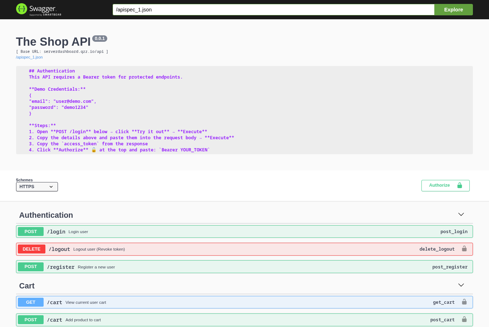
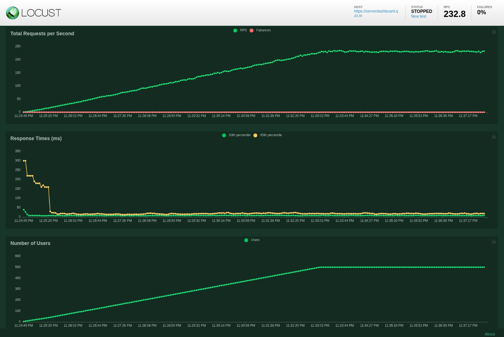
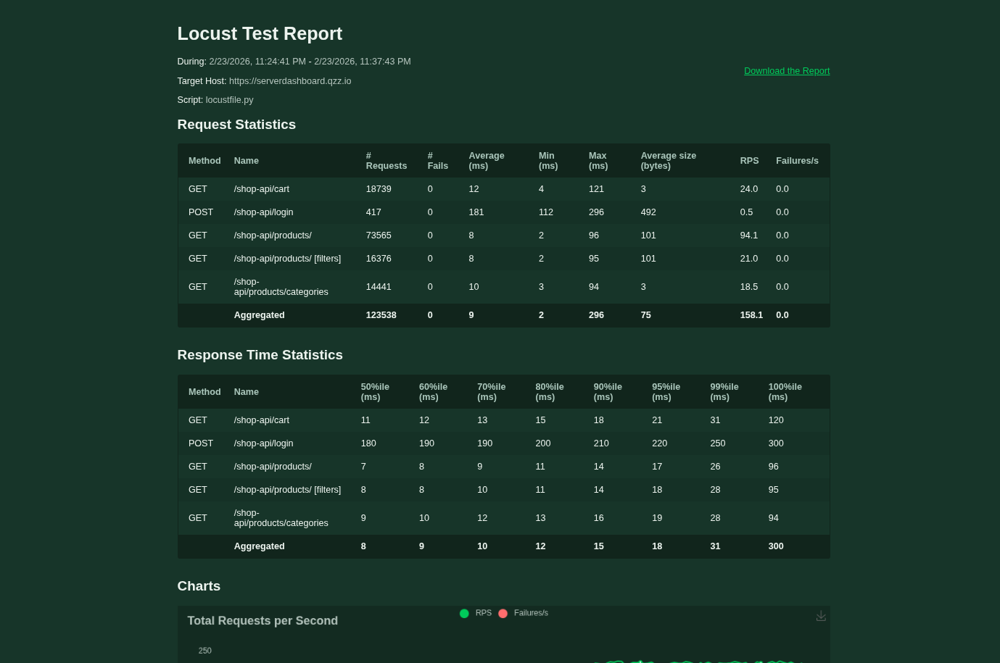
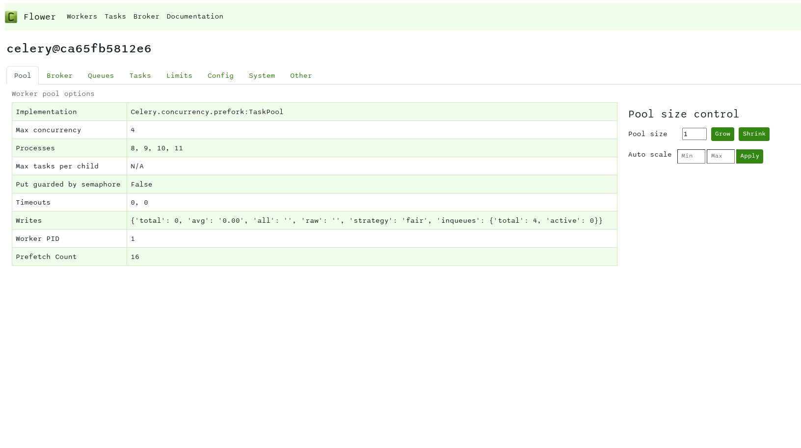

# Flask E-commerce API

> A robust, scalable, and production-ready e-commerce API built with Flask.

<p align="center">
  
  
  <br>
  
  
</p>


**API Documentation:** [https://serverdashboard.qzz.io/shop-api/swagger](https://serverdashboard.qzz.io/shop-api/swagger)

**Load Testing Dashboard:** [https://serverdashboard.qzz.io/shop-api/locust/](https://serverdashboard.qzz.io/shop-api/locust/)

**Task Monitoring Dashboard:** [https://serverdashboard.qzz.io/shop-api/flower](https://serverdashboard.qzz.io/shop-api/flower)

---

## High-Performance E-commerce Backend

This repository contains a fully, containerized Flask API designed for e-commerce applications. It provides features for managing products, users, carts and orders, with a focus on performance, scalability and security.


### Project Overview

This API was developed to serve as a flexible backend for modern e-commerce frontends. The goal is to provide a reliable, well-documented and feature-rich foundation that can be scalled and used to build custom online stores.

By leveraging technologies like Celery for background tasks, Redis for caching and Locust for load testing, the API is engineered to handle high traffic loads and deliver a smooth user experience.

---

### The Stack

| Category              | Technology                                       |
| --------------------- | ------------------------------------------------ |
| **Backend Framework** | Flask                                            |
| **Database**          | PostgreSQL                                       |
| **Caching**           | Redis, Flask-Caching                             |
| **Rate Limiting**     | Flask-Limiter                                    |
| **Asynchronous Tasks**| Celery, Redis                                    |
| **Task Monitoring**   | Flower                                           |
| **API Documentation** | Flasgger (Swagger UI)                            |
| **Load Testing**      | Locust                                           |
| **Containerization**  | Docker, Docker Compose                           |
                                         
---

### Key Features

#### 1. Core E-commerce Functionality
The API provides a complete set of endpoints for managing the core components of an e-commerce platform.

*   **User Management:** Secure registration and JWT-based authentication.
*   **Product & Category Management:** Full CRUD operations for products and categories.
*   **Shopping Cart:** Persistent cart functionality for authenticated users.
*   **Order Processing:** Endpoint for creating and retrieving customer orders.

#### 2. Performance and Scalability
optimized to handle production-level traffic and ensure fast response times.

*   **Caching:** Redis-backed caching is implemented on frequently accessed, read-heavy endpoints (e.g., getting products) to reduce database load.
*   **Asynchronous Operations:** Long-running tasks, such as sending order confirmation emails, are offloaded to a Celery worker to avoid blocking API responses.
*   **Rate Limiting:** Endpoints are protected with rate limiting to prevent abuse and ensure fair usage.

---

### Architecture
The system uses a decoupled, containerized stack designed for high-concurrency and horizontal scaling.

**API Layer (Flask + Gunicorn):** High-performance backend handling RESTful traffic.

**Database (PostgreSQL):** Persistent relational storage for core application data.

**Message Broker & Cache (Redis):** Dual-purpose engine for task queuing and fast data retrieval.

**Asynchronous Processing (Celery):** Distributed workers that offload heavy tasks like Emails to keep the API responsive.


---

### CI/CD Pipeline
Automated deployment is managed via Jenkins, ensuring code quality and zero-downtime updates.

**Continuous Integration:** Automatically triggers on every push to main.

**Deployment:** Syncs code to the production environment and rebuilds Docker containers using docker compose.

**Cleanup:** Automated image pruning to maintain server disk health.

---

### Deployment and Setup

#### 1. Prerequisites
*   [Docker](https://docs.docker.com/get-docker/)
*   [Docker Compose](https://docs.docker.com/compose/install/)

#### 2. Installation
1.  **Clone the repository:**
    ```bash
    git clone https://github.com/your-username/flask-ecommerce-API.git
    cd flask-ecommerce-API
    ```

2.  **Configure Environment Variables:**

    Create a `.env` file in the root directory with the following variables.

    ```
    SECRET_KEY=your_very_secret_key_here
    DATABASE_URL=postgresql://user:password@db/ecommerce
    REDIS_URL=redis://redis:6379/0
    CELERY_BROKER_URL=redis://redis:6379/0
    CELERY_RESULT_BACKEND=redis://redis:6379/0
    FLOWER_PORT=5555
  


#### 3. Running the Application
1.  **Build and run the services with Docker Compose:**
    ```bash
    docker-compose up --build -d
    
    This starts all the services (api, db, redis, worker)

2.  **Apply database migrations:**
    Once the containers are running, apply the initial database schema:
    ```bash
    docker-compose exec api alembic upgrade head

3.  **Seed the database (optional):**
    To populate the database with sample data:
    ```bash
    docker-compose exec api python seed.py

The API will now be running and accessible at `http://localhost:5000`.

---

### Usage

#### API Documentation (Swagger UI)
Interactive API documentation is available through Swagger UI. This is the best place to explore the available endpoints and their parameters.

- **Swagger UI:**  
  [https://serverdashboard.qzz.io/shop-api/swagger](https://serverdashboard.qzz.io/shop-api/swagger)

#### Celery Monitoring 
A web-based tool for monitoring and administrating Celery clusters.

- **Flower:**  
  [https://serverdashboard.qzz.io/shop-api/flower](https://serverdashboard.qzz.io/shop-api/flower)

#### Load Testing with Locust
This project includes a `locustfile.py` for load testing the API.

- **Locust:**  
  [https://serverdashboard.qzz.io/shop-api/locust](https://serverdashboard.qzz.io/shop-api/locust)
---

### License
Distributed under the MIT License. See [LICENSE](licence) for more information.
